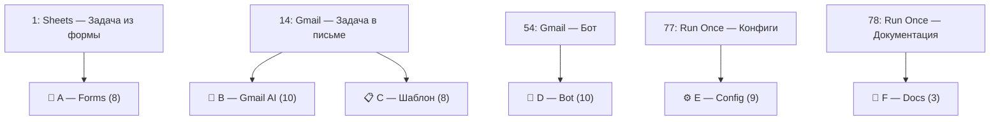
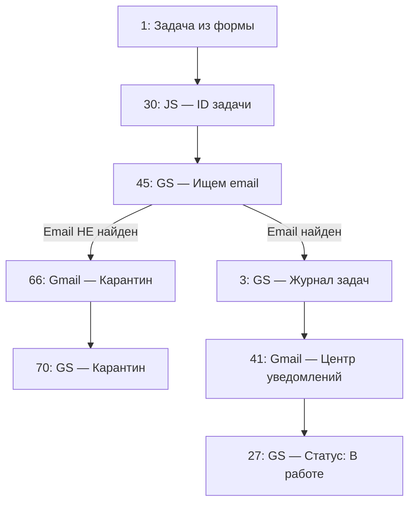
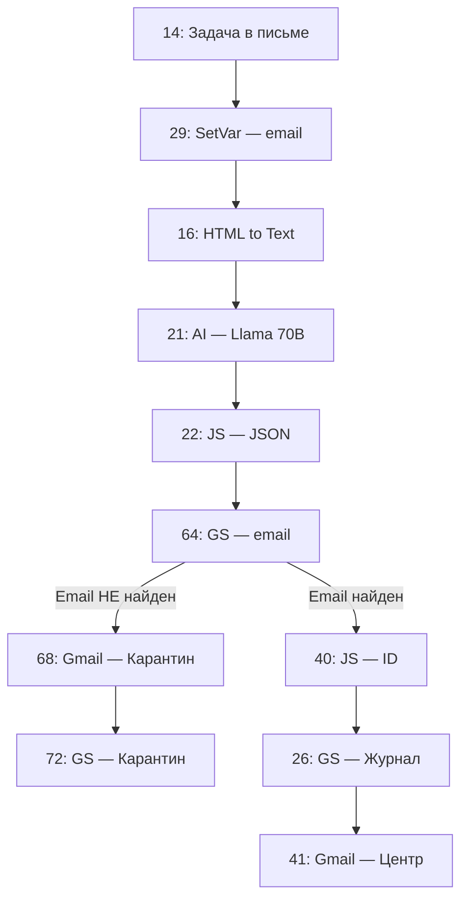
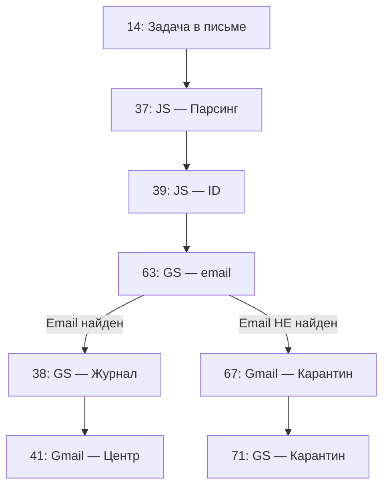
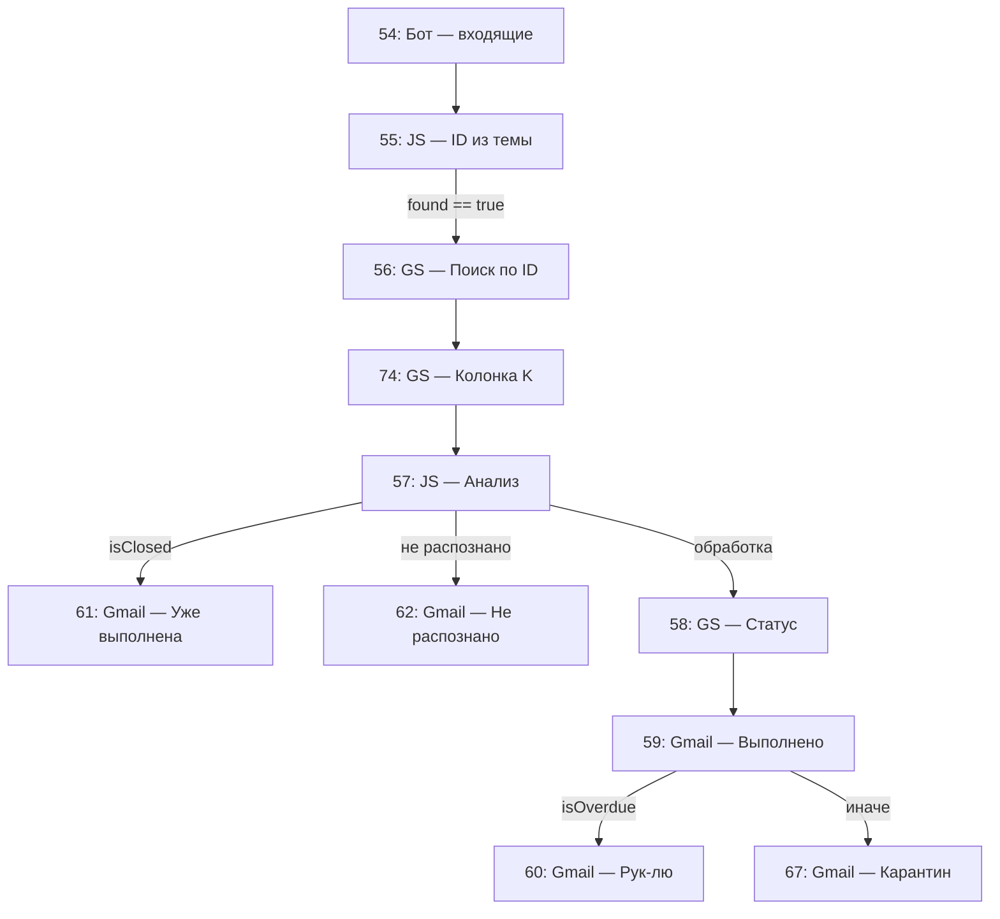
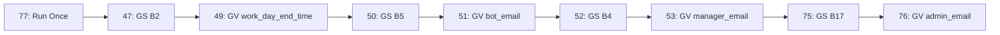
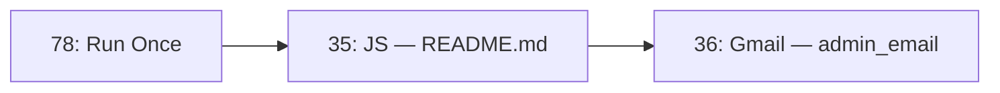

# Workflow A — Task Processing

> Сценарий автоматического приёма, нормализации и журналирования задач.
> Источники: Gmail + Google Forms → единый журнал в Google Sheets → уведомления исполнителям.

**Версия:** 485 · **Узлов:** 46 (5 триггеров + 41 действие) · **Рёбер:** 45 · **Веток:** 6

---

## Назначение

Сценарий автоматически принимает задачи из двух источников — новых писем Gmail и ответов Google Forms. Данные нормализуются к единому формату, регистрируются в Google Sheets, исполнителю отправляется уведомление с идентификатором задачи.

- **Ветка Gmail** — AI-парсинг текста письма (Llama 3.1 70B).
- **Ветка Google Forms** — прямое маппирование полей.

---

## Общая архитектура

```
Google Sheets: «Журнал задач и поручений (автоматизированный)»

Листы:
  • Журнал задач           — основной реестр задач
  • Справочник исполнителей — имя (A) / email (B)
  • Автолист формы         — приём ответов Google Forms
  • Настройки              — B2, B4, B5, B17
  • Лог уведомлений        — логирование отправки
  • Карантин               — задачи с ненайденными сотрудниками
```



---

## Триггеры (5)

| ID | Тип | Заголовок | Событие |
|----|-----|-----------|---------|
| 1 | Google Sheets | Задача из формы | Новая строка в «Автолисте формы» |
| 14 | Gmail | Задача в письме | Новое входящее письмо |
| 54 | Gmail | Бот: входящие письма | Ответ сотрудника на уведомление |
| 77 | Run Once | Загрузить конфиги из Настроек | Ручной запуск |
| 78 | Run Once | Запустить автодокументирование | Ручной запуск |

---

## Ветка A — Google Forms (8 узлов)



| ID | Узел | Тип | Назначение |
|----|------|-----|-----------|
| 1 | Задача из формы | Trigger (Sheets) | Новая строка в «Автолисте формы» |
| 30 | Генерация уникального ID задачи | JS (Bun) | `FORM-T-{timestamp}` |
| 45 | Ищем email | GS (search) | Поиск email в «Справочнике исполнителей» |
| 3 | Журнал задач | GS (write) | Запись строки в «Журнал задач» |
| 41 | Единый центр уведомлений | Gmail | Уведомление исполнителю (общий A/B/C) |
| 27 | Статус: В работе | GS (update) | `H[row] = «В работе»` |
| 66 | Карантин: ответ (Forms) | Gmail | Ответ: сотрудник не найден |
| 70 | Карантин (Forms) | GS (write) | Запись в «Карантин» |

---

## Ветка B — Gmail: неструктурированные письма + AI (10 узлов)



| ID | Узел | Тип | Назначение |
|----|------|-----|-----------|
| 14 | Задача в письме | Trigger (Gmail) | Новое письмо без `[Исполнитель]` |
| 29 | Сохраняем email | Set Variables | Извлечение адреса из `To` |
| 16 | Извлекает тело письма | HTML to Text | Декодирование тела |
| 21 | AI: Text Generation | AI | Текст → JSON (Имя, Задача, Дедлайн, Приоритет) |
| 22 | Обрезать до/после JSON | JS (Bun) | Обрезка ответа LLM до `{` |
| 64 | Email из справочника (AI) | GS (search) | Поиск email по имени |
| 40 | Генерация ID (AI) | JS (Bun) | `GML-AI-{timestamp}` |
| 26 | Журнал задач | GS (write) | Запись строки |
| 41 | Единый центр уведомлений | Gmail | Уведомление (общий A/B/C) |
| 68 | Карантин: ответ (AI) | Gmail | Ответ: сотрудник не найден |
| 72 | Карантин (AI) | GS (write) | Запись в «Карантин» |

---

## Ветка C — Gmail: письма по шаблону [Исполнитель] (8 узлов)



| ID | Узел | Тип | Назначение |
|----|------|-----|-----------|
| 14 | Задача в письме | Trigger (Gmail) | Новое письмо с `[Исполнитель]` |
| 37 | Парсинг шаблона | JS (Bun) | Извлечение полей из шаблона |
| 39 | Генерация ID (шаблон) | JS (Bun) | `TPL-{timestamp}` |
| 63 | Email из справочника (шаблон) | GS (search) | Поиск email по имени |
| 38 | Журнал задач (шаблон) | GS (write) | Запись строки |
| 41 | Единый центр уведомлений | Gmail | Уведомление (общий A/B/C) |
| 67 | Карантин: ответ (шаблон) | Gmail | Ответ: сотрудник не найден |
| 71 | Карантин (шаблон) | GS (write) | Запись в «Карантин» |

---

## Ветка D — Бот обработки ответов (10 узлов)



| ID | Узел | Тип | Назначение |
|----|------|-----|-----------|
| 54 | Бот: входящие письма | Trigger (Gmail) | Ответы сотрудников |
| 55 | Извлечь ID из темы | JS (Bun) | Парсинг `#FORM-T-…` / `#GML-AI-…` |
| 56 | Поиск задачи по ID | GS (search) | Поиск строки в «Журнале» |
| 74 | Читаем колонку K (ID) | GS (read) | Чтение ID из строки |
| 57 | Анализ сроков и текста | JS (Bun) | `isClosed`, `hasKeywords`, `isOverdue` |
| 61 | Ответ: уже выполнена | Gmail | Задача уже закрыта |
| 62 | Ответ: не распознано | Gmail | Нет ключевых слов |
| 58 | Обновить статус задачи | GS (update) | Обновление статуса |
| 59 | Ответ сотруднику (выполнено) | Gmail | Подтверждение выполнения |
| 60 | Уведомление руководителю (просрочка) | Gmail | Эскалация на `manager_email` |

---

## Ветка E — Конфигурационная цепочка (9 узлов)



| ID | Узел | Ячейка | Переменная |
|----|------|--------|-----------|
| 77 | Загрузить конфиги из Настроек | — | — |
| 47 → 49 | Читаем / Сохраняем work_day_end_time | B2 | `work_day_end_time` |
| 50 → 51 | Читаем / Сохраняем bot_email | B5 | `bot_email` |
| 52 → 53 | Читаем / Сохраняем manager_email | B4 | `manager_email` |
| 75 → 76 | Читаем / Сохраняем admin_email | B17 | `admin_email` |

---

## Ветка F — Мета-процесс автодокументирования (3 узла)



| ID | Узел | Тип | Назначение |
|----|------|-----|-----------|
| 78 | Запустить автодокументирование | Trigger (Run Once) | Ручной запуск |
| 35 | Генерация README.md | JS (Bun) | Формирование Markdown-документации |
| 36 | Отправка документации | Gmail | Доставка `.md` на `admin_email` |

---

## Точка слияния — узел 41 «Единый центр уведомлений»

```
Ветка A:  3 ─► 41
Ветка B: 26 ─► 41   (Email из справочника найден)
Ветка C: 38 ─► 41   (Email из справочника найден)
                    │
                    └──► 27  (только из ветки A: «Статус: В работе»)
```

---

## Глобальные переменные

| Переменная | Источник | Потребители |
|-----------|----------|-------------|
| `work_day_end_time` | `Настройки!B2` | Узел 57 — расчёт просрочек |
| `bot_email` | `Настройки!B5` | Отправитель всех Gmail-уведомлений |
| `manager_email` | `Настройки!B4` | Узел 60 — эскалация просрочек |
| `admin_email` | `Настройки!B17` | Узел 36 — получатель документации |

---

## Сводка по типам узлов

| Тип | Кол-во |
|-----|--------|
| Trigger: Google Sheets | 1 |
| Trigger: Gmail | 2 |
| Trigger: Run Once | 2 |
| Action: Google Sheets | 16 |
| Action: Gmail | 11 |
| Action: JS Code (Bun) | 9 |
| Action: AI Text Generation | 1 |
| Action: HTML to Text | 1 |
| Action: Set Variables | 1 |
| Action: Set Global Variables | 4 |

---

## Сводка по веткам

| Ветка | Триггер | Узлов | Суть |
|-------|---------|-------|------|
| 📝 Forms | 1 (Sheets) | 8 | Форма → ID → email → журнал / карантин |
| 🤖 Gmail AI | 14 (Gmail) | 10 | AI-парсинг → журнал / карантин |
| 📋 Gmail Шаблон | 14 (Gmail) | 8 | Шаблон `[Исполнитель]` → журнал / карантин |
| 💬 Bot Ответов | 54 (Gmail) | 10 | Ответ → поиск ID → анализ → 3 сценария |
| ⚙️ Config | 77 (Run Once) | 9 | Настройки → 4 глобальные переменные |
| 📄 Docs | 78 (Run Once) | 3 | Генерация README.md → отправка админу |
| | **Итого** | **46** | |

---

*Сгенерировано автоматически мета-процессом автодокументирования: 18.08.2026, 14:37:30*
