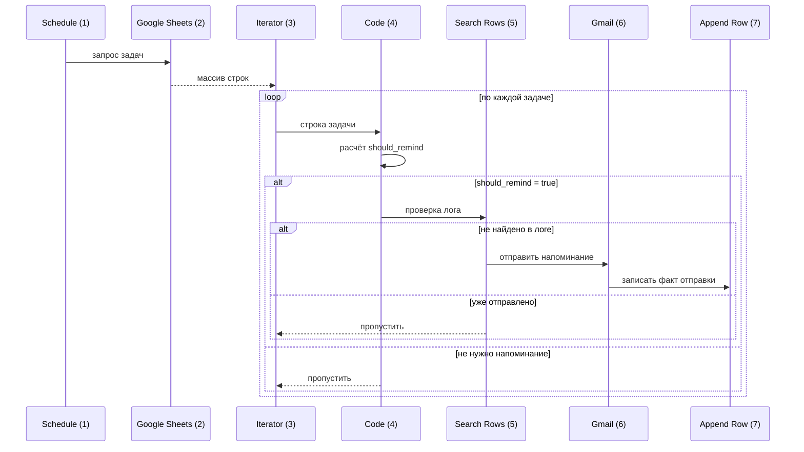

# 📋 Документация сценария: Workflow B — Monitoring & Reporting

> **Описание:** Сценарий предназначен для автоматического мониторинга дедлайнов задач, хранящихся в Google Sheets, и отправки умных напоминаний пользователям. Система проверяет сроки выполнения задач и уведомляет ответственных лиц о приближающихся дедлайнах или просроченных задачах.

## 🗺 Диаграммы потоков

### Обзорная схема сценария

```mermaid
graph TD
    subgraph Reminders["🔔 Напоминания"]
        A1["Schedule (1)<br/>каждые 30 мин"] --> A2["Get Values (2)<br/>Журнал задач"]
        A2 --> A3["Iterator (3)<br/>цикл по задачам"]
        A3 --> A4["Code (4)<br/>расчёт напоминаний"]
        A4 -->|should_remind = true| A5["Search Rows (5)<br/>Лог уведомлений"]
        A5 -->|нет в логе| A6["Gmail (6)<br/>напоминание"]
        A6 --> A7["Append Row (7)<br/>запись в лог"]
    end

    subgraph Docs["📄 Документация"]
        B1["Run Once (10)<br/>мета-процесс"] --> B2["JS (11)<br/>генерация README.md"]
        B2 --> B3["Gmail (12)<br/>отправка документации"]
    end

    subgraph Reports["📊 Отчёты"]
        C1["Schedule (47)<br/>ежедневно 17:30"] --> C2["Get Values (49)"]
        C2 --> C3["JS (51)<br/>Daily Report"]
        C3 --> C4["Gmail (53)<br/>manager"]
        D1["Schedule (48)<br/>еженедельно пт 16:00"] --> D2["Get Values (50)"]
        D2 --> D3["JS (52)<br/>Weekly Report"]
        D3 --> D4["Gmail (54)<br/>manager"]
    end

    subgraph Config["⚙️ Конфигурация"]
        E1["Run Once (13)"] --> E2["Get Values (55)<br/>Настройки B2:B17"]
        E2 --> E3["JS (56)<br/>собрать конфиг"]
    end
```

### Поток отправки напоминаний (sequence)

## 🔔 Триггеры

| ID | Тип | Название | Описание |
|----|-----|----------|----------|
| 1 | Schedule | Schedule — каждые 30 минут | Запускает сценарий автоматически каждые 30 минут |
| 10 | Run Once | Мета-процесс автодокументирования | Ручной запуск для генерации документации сценария |
| 13 | Run Once | Загрузить конфиги из Настроек | Ручной запуск загрузки конфигурации |
| 47 | Schedule | Ежедневный отчёт — 17:30 | Ежедневная генерация отчёта |
| 48 | Schedule | Еженедельный отчёт — пятница 16:00 | Еженедельная генерация отчёта |

## 📊 Узлы сценария

| ID | Тип | Название | Роль |
|----|-----|----------|------|
| 1 | Schedule | Schedule — каждые 30 минут | Триггер по расписанию (каждые 30 минут) |
| 2 | Google Sheets | Get Values — Журнал задач | Чтение всех значений из Google-таблицы с задачами |
| 3 | Iterator | Iterator — цикл по задачам | Перебор каждой строки-задачи |
| 4 | JavaScript | Code — расчёт напоминаний | Анализ дедлайна и вычисление необходимости напоминания |
| 5 | Google Sheets | Search Rows — Лог уведомлений | Проверка: было ли уже отправлено напоминание по задаче |
| 6 | Gmail | Gmail Send — напоминание | Отправка email-уведомления ответственному |
| 7 | Google Sheets | Append Row — запись в лог | Запись факта отправки в лог-таблицу |
| 10 | Run Once | Мета-процесс автодокументирования | Ручной запуск генерации документации |
| 11 | JavaScript | Генерация документации | Формирование Markdown-документации и сохранение в .md файл |
| 12 | Gmail | Отправка документации | Отправка документации на почту |
| 13 | Run Once | Загрузить конфиги из Настроек | Ручной запуск загрузки конфигурации |
| 47 | Schedule | Ежедневный отчёт — 17:30 | Триггер ежедневного отчёта |
| 48 | Schedule | Еженедельный отчёт — пятница 16:00 | Триггер еженедельного отчёта |
| 49 | Google Sheets | Get Values — для Daily отчёта | Чтение данных для ежедневного отчёта |
| 50 | Google Sheets | Get Values — для Weekly отчёта | Чтение данных для еженедельного отчёта |
| 51 | JavaScript | JS: Daily Report A | Формирование ежедневного отчёта |
| 52 | JavaScript | JS: Weekly Report | Формирование еженедельного отчёта |
| 53 | Gmail | Gmail: Daily Report → manager | Отправка ежедневного отчёта менеджеру |
| 54 | Gmail | Gmail: Weekly Report → manager | Отправка еженедельного отчёта менеджеру |
| 55 | Google Sheets | Get Values — Настройки B2:B17 | Чтение настроек |
| 56 | JavaScript | JS: собрать конфиг | Сборка конфигурации |

## 🔗 Ветки и переходы

| От узла | К узлу | Условие | Описание |
|---------|--------|---------|----------|
| Schedule (1) output | Get Values (2) input | — | Основной поток: запуск по расписанию |
| Get Values (2) output | Iterator (3) input | — | Передача массива задач в итератор |
| Iterator (3) cycle | Code (4) input | — | Обработка каждой задачи |
| Code (4) output | Search Rows (5) input | should_remind = true | Только если нужно напоминание |
| Search Rows (5) output | Gmail (6) input | empty(rows) — нет в логе | Только если уведомление ещё не отправлялось |
| Gmail (6) output | Append Row (7) input | — | Логирование отправки |
| Run Once (10) output | Генерация документации (11) input | — | Мета-процесс документации |
| Генерация документации (11) output | Отправка документации (12) input | — | Отправка сгенерированного файла |
| Schedule (47) output | Get Values (49) input | — | Ежедневный отчёт |
| Get Values (49) output | JS Daily Report (51) input | — | Формирование отчёта |
| JS Daily Report (51) output | Gmail Daily (53) input | — | Отправка менеджеру |
| Schedule (48) output | Get Values (50) input | — | Еженедельный отчёт |
| Get Values (50) output | JS Weekly Report (52) input | — | Формирование отчёта |
| JS Weekly Report (52) output | Gmail Weekly (54) input | — | Отправка менеджеру |
| Run Once (13) output | Get Values Настройки (55) input | — | Загрузка конфигов |
| Get Values Настройки (55) output | JS собрать конфиг (56) input | — | Сборка конфигурации |

## 📁 Схема листов Google Sheets

### Журнал задач (Get Values)

| Столбец | Поле | Тип | Описание |
|---------|------|-----|----------|
| A | task_id | string | Уникальный идентификатор задачи |
| B | task_name | string | Название задачи |
| C | deadline | datetime | Дедлайн выполнения |
| D | responsible_email | string | Email ответственного |
| E | status | string | Статус задачи |

### Лог уведомлений (Search Rows / Append Row)

| Столбец | Поле | Тип | Описание |
|---------|------|-----|----------|
| A | task_id | string | ID задачи |
| B | sent_at | datetime | Время отправки уведомления |
| C | recipient | string | Email получателя |

## 🌐 Глобальные переменные

| Ключ | Тип |
|------|-----|
| admin_email | string |
| bot_email | string |
| daily_report_time | string |
| default_priority | string |
| manager_email | string |
| quiet_hours_end | string |
| quiet_hours_start | string |
| reminder_A_1_hours | string |
| reminder_A_2_hours | string |
| reminder_A_hours_before | string |
| reminder_B_days_before | string |
| reminder_C_days_before | string |
| task_id_prefix | string |
| timezone | string |
| weekly_report_day | string |
| weekly_report_time | string |
| work_day_end_time | string |

---

_Документация сгенерирована автоматически: 2026-08-18T15:05:52.337Z_
